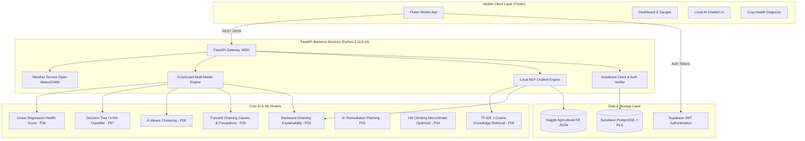
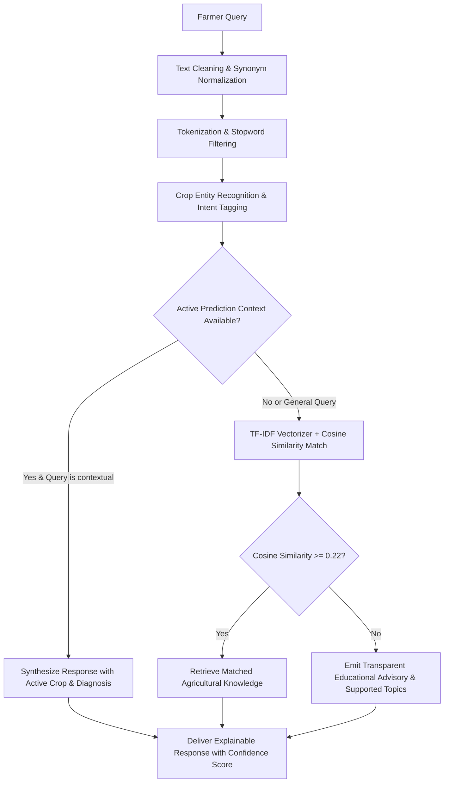

# CropGuard AI: System Architecture & Technical Specifications

---

## 1. End-to-End System Architecture

---

## 2. Multi-Model AI Prediction Pipeline

When a prediction is requested for a given crop and location:
1. **Weather Ingestion:** Real-time sensor values (temperature, relative humidity, precipitation, wind speed) are retrieved via the pluggable `WeatherService` (Open-Meteo / OpenWeatherMap).
2. **Feature Preprocessing:** Features are mapped into continuous normalized tensors for regression and classification, and discretized into proposition facts for expert rules.
3. **Continuous Prediction:** Practical 06 (Multiple Linear Regression) calculates the exact `crop_health_score` (0.0 to 100.0).
4. **Categorical Risk Assessment:** Practical 07 (CART Decision Tree) assigns the operational risk tier: `Healthy`, `At Risk`, or `High Risk`.
5. **Agro-Climatic Zoning:** Practical 08 (K-Means Clustering) determines the micro-climate archetype (`Favorable Regime`, `Moderate Stress`, or `Critical Vulnerability`).
6. **Deductive Etiology:** Practical 05 (Forward Chaining) fires domain rules to discover primary contributing causes and synthesize prioritized precautions.
7. **Transparent Explainability:** Practical 05 (Backward Chaining) tests why the primary risk condition was declared and outputs a human-readable justification string.

---

## 3. Local NLP Farmer Chatbot Architecture (Zero External LLMs)

---

## 4. Supabase Database & Security Architecture

- **PostgreSQL Database Tables:**
  - `profiles`: Farmer personal records, geographical location, primary cultivated crops.
  - `prediction_history`: Structured logs of every prediction (weather telemetry, continuous score, risk status, causes, precautions, timestamp).
  - `chat_history`: Conversation logs stored securely.
  - `crop_knowledge`: Public domain reference agronomic envelopes.
- **Row Level Security (RLS):**
  - All farmer tables enforce `auth.uid() = user_id`. No farmer can view, alter, or delete another farmer's historical records.
  - Client connections operate strictly with the public anonymous key (`SUPABASE_ANON_KEY`); administrative service-role keys are prohibited in client source code.
